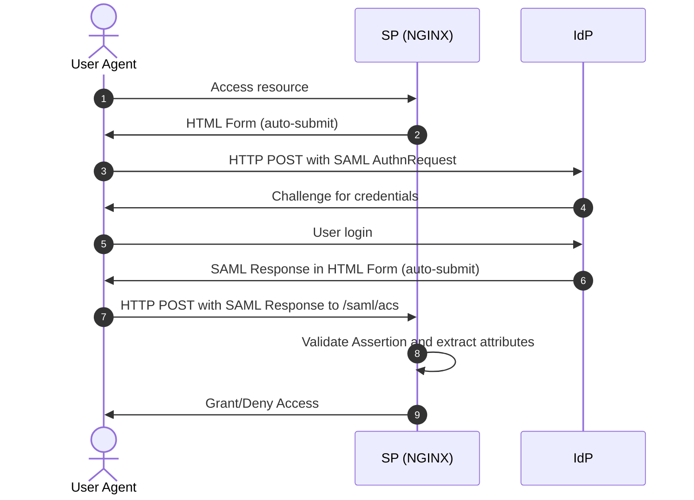

# NGINX Plus images for F5XC vK8S

Nginx Plus can be deployed easily in F5XC as PaaS in vK8S (or mK8S) in order to bring capablities like SAML or OIDC. But it must run in unprivileged mode (non-root)
In this repo, we maintain N+ docker image for SAML SP and OIDC Relying Party.

## N+ as SAML Service Provider

Full doc here : [NGINX Plus](./SAML/README.md)

In this section, you can build your own N+ image in order to run N+ in vK8S as SAML SP.
The projecty is based on official and supported Nginx PLUS SAML SP module : https://github.com/nginxinc/nginx-saml

`Figure 1. SAML SP-Initiated SSO with POST Bindings for AuthnRequest and Response`

## N+ as OIDC Relying Party

Full doc here : [NGINX Plus](./OIDC/README.md)

In this section, you can build your own N+ image in order to run N+ in vK8S as OIDC Relying Party
The projecty is based on official and supported Nginx PLUS OIDC module : https://github.com/nginxinc/nginx-openid-connect

`Figure 2. OpenID Connect authorization code flow protocol`